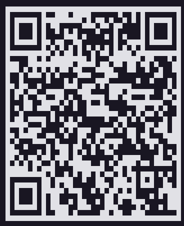

Nomes:
- 558385 - Alexia Ramalho
- 557943 - Enzo Real
- 555454 - Gustavo Pasquini
- 559008 - Hellen Silva
- 557397 - Lorenzo Acquesta


# 🚗 CarSync: Inteligência Veicular Ford
### Desafio escolhido: Desafio 2 - Retenção de Clientes no Pós-venda
> **Projeto estratégico desenvolvido para o Challenge Ford 2026**

O **CarSync** é um MVP (Minimum Viable Product) focado na experiência do motorista moderno. Ele nasceu com a missão de transformar o smartphone em uma central de comando secundária, totalmente integrada à multimídia do veículo e potencializada por Inteligência Artificial.

## 💡 O Conceito
Diferente de apps de manutenção comuns, o CarSync foi desenhado para ser uma extensão do carro:
- **Ser Extensivo à Multimídia**: Interface otimizada para ser espelhada ou consumida via APIs de infoentretenimento da Ford.
- **IA Generativa (Fordinho)**: Um assistente pessoal que entende o estado do carro e proativamente sugere ações.
- **Foco no Motorista**: Redução de carga cognitiva com dashboards simplificados e agendamentos inteligentes.

---

## ✨ Funcionalidades Principais (MVP)

### 📊 Dashboard de Diagnóstico em Tempo Real
O coração do monitoramento do veículo. Projetado para simular a leitura de dados via porta OBD-II da Ford.
- **Medidores Visuais**: Acompanhamento de velocidade, nível de combustível, pressão dos pneus e nível de óleo.
- **Status do Veículo**: Listagem detalhada de RPM, temperaturas e outros sensores essenciais (OBD-II Ready).

### 🤖 Chat IA: "Fordinho"
Assistente proativo integrado ao sistema para suporte técnico e interação intuitiva.
- **Interface Humanizada**: Indicadores de digitação dinâmicos e balões de chat exclusivos.
- **Conhecimento Técnico**: Respostas baseadas em diagnósticos reais e manuais do veículo.

### 📅 Sistema de Agendamento Inteligente
Conecta o motorista diretamente à rede de concessionárias Ford.
- **Calendário Customizado**: Experiência fluida para seleção de slots de manutenção sem libs externas.
- **Localização**: Identificação automática das unidades mais próximas para agilidade.


### Instalação rápida

Escaneie o QR code abaixo com a câmera do celular para baixar e instalar o APK da última build gerada:



> Esse QR code aponta para uma build específica. Ao gerar uma nova (veja abaixo), substitua a imagem em `assets/images/apk-qrcode.png` pelo QR code da build atual.

### Gerar o APK

Pré-requisitos: Node.js, uma conta Expo com acesso ao projeto e o EAS CLI instalado.

```bash
npm install -g eas-cli
eas login
```

Dentro de `App-CarSync/`:

```bash
eas build --platform android --profile preview
```

> A URL da API (`EXPO_PUBLIC_API`) já vem definida no `eas.json` para os builds na nuvem — não depende do `.env` local (que só vale para rodar via `npm start`, veja o [COMO_COMECAR.md](./COMO_COMECAR.md)).

O build roda na nuvem e, ao final, gera um link de download do `.apk` — o mesmo link também fica disponível em [expo.dev](https://expo.dev), na página do projeto.

### Instalar no celular

1. No Android, habilite **"Instalar apps de fontes desconhecidas"** (normalmente pedido automaticamente na primeira tentativa de instalação).
2. Abra o link do build direto no navegador do celular e toque no `.apk` baixado para instalar.
   - Alternativa via cabo/ADB: `adb install caminho/para/o/arquivo.apk`.
3. Abra o app normalmente após a instalação.

> ⚠️ O app depende da API em `https://api.carsync.me` para login e cadastro — é necessário estar conectado à internet.

---

## 🏗️ Arquitetura e Organização
Para garantir escalabilidade, o projeto segue padrões de engenharia Enterprise:

- **Componentização Modular**: Divisão clara entre **View** (`index.tsx`) e **Styles** (`style.ts`) em cada diretório de componente.
- **Camada de Domínio**: Interfaces e contratos centralizados em `src/interfaces/`, garantindo que o código seja totalmente Type-Safe.
- **Estado Global**: Gerenciamento de sessão e autenticação via `AuthContext`.
- **Navegação Moderna**: Utilização do `Expo Router` (File-based Routing) para uma estrutura de pastas limpa.

---

## 🎨 Design System e Estilos
A identidade visual do CarSync é centralizada e baseada em tokens de design, facilitando manutenções e garantindo a consistência da marca Ford.

**Localização Central**: `constants/Constants.ts`

### Paleta de Cores Identitária:
- **Primárias**: Azul Ford (`#347ED5`), Azul Claro (`#A1BCE1`).
- **Feedback Visual**: Verde (Sucesso), Amarelo (Atenção), Vermelho (Crítico).
- **Gradientes Exclusivos**:
  - `degrade_login`: Transição elegante do azul profundo ao laranja (Identidade Login).
  - `gradiente_amarelo`: Utilizado para destacar o mascote Fordinho.

---

## 🚀 Visão de Futuro
Como este é um MVP, os próximos passos visam a integração profunda com o hardware Ford:
1. **Integração SYNC 4/5**: Renderização nativa na tela multimídia via Android Auto/Apple CarPlay.
2. **Telemetria Proativa**: Notificações push baseadas em desgaste real de peças via telemetria avançada.
3. **Voice Commands**: Controle total de periféricos (ar-condicionado, janelas) via comando de voz integrado à IA.
