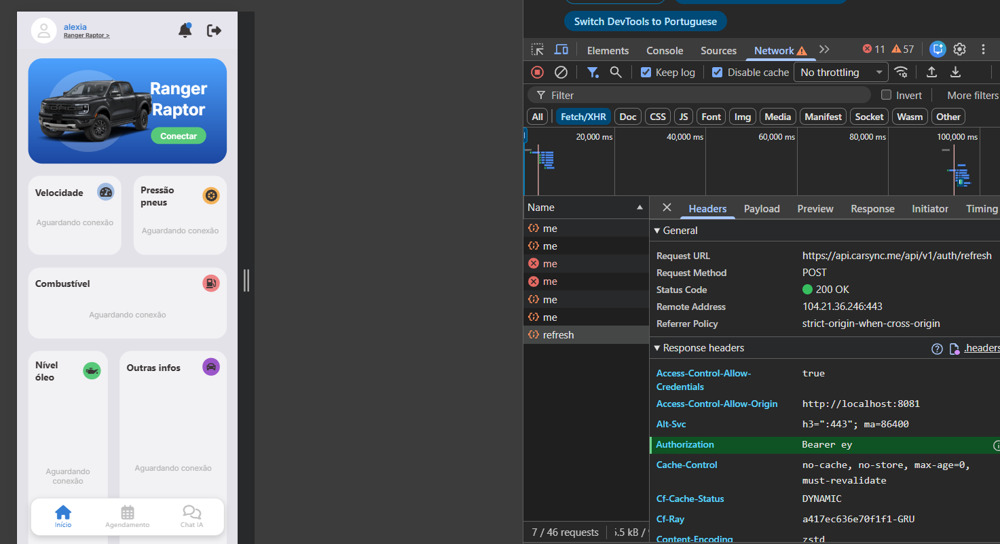
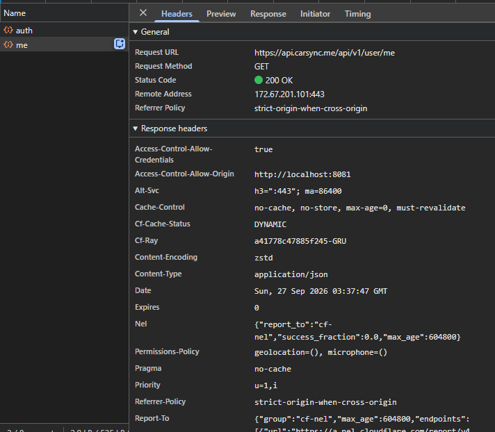
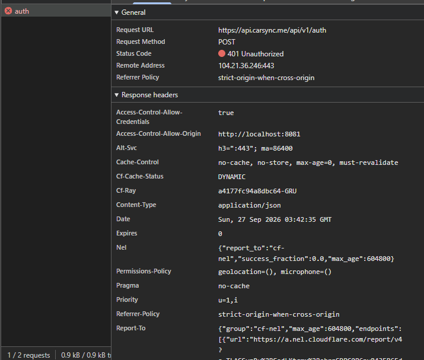
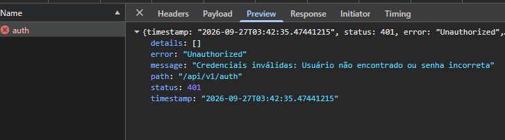
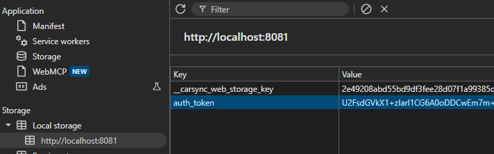
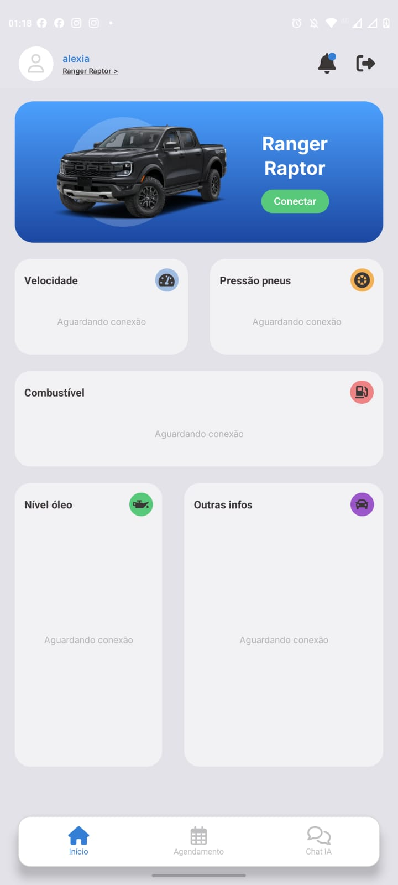
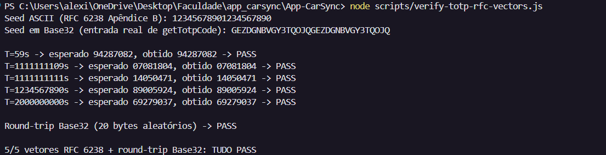
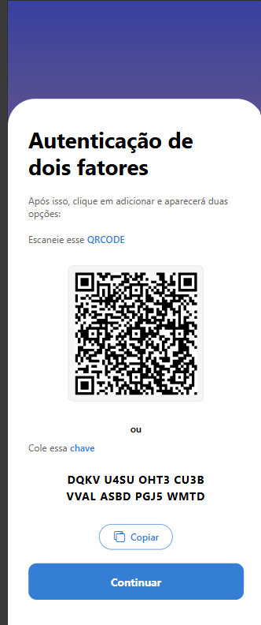

Spec / base SHA / responsável / repositório:
03-frontends / 99e2e25877dd25dcd7d1714ffa33b5bea3062be6 / Claude (agente) / App-CarSync (branch feat/cybersecurity)

Observação de protocolo: EXECUTION.md pede worktree dedicado (`git worktree add -b sec-2026/03-frontends`).
Este trabalho foi feito diretamente na branch `feat/cybersecurity`, já isolada da main e criada
pelo mantenedor para esta frente, para não fragmentar o ambiente de desenvolvimento em uso.

---

Checkpoint: T1.C1
Estado: VERIFICADO
Requisito: R07 (inventário)
Arquivos e teste/comando: inspeção direta de src/ e app/ + varredura por AsyncStorage/SecureStore/expo-file-system
Resultado observado e data: 2026-09-26

Inventário:
- Plataforma: Expo/React Native (iOS, Android, Web). Base URL: EXPO_PUBLIC_API (https://api.carsync.me/).
- Único dado sensível persistido no cliente: o JWT (`auth_token`), via src/utils/secureStorage.ts.
  - Nativo (iOS/Android): expo-secure-store — Keychain/Keystore, já criptografado pelo SO.
  - Web: AsyncStorage puro, sem nenhuma criptografia (achado corrigido em T3.C1).
- `auth_user` (src/contexts/AuthContext.tsx) é código morto: só é deletado (linhas 55 e 117 antes desta
  auditoria), nunca escrito. Nenhum dado de usuário fica persistido sob essa chave.
- src/contexts/VehicleContext.tsx usa AsyncStorage direto para preferências não sensíveis (veículo/ícone
  de perfil escolhidos) — fora de escopo do R07.
- src/services/AudioQueuePlayer.ts usa expo-file-system para cache temporário de áudio (.mp3), sem dado
  sensível, limpo com deleteAsync — fora de escopo.
- MFA/2FA (MfaContainer, TwoFactorQRCodeContainer, TwoFactorSetupContainer, TwoFactorSuccessContainer):
  UI desconectada do fluxo real. Secret exibido é placeholder hardcoded, QR é um View vazio, `signIn()`
  chamado por essas telas é um no-op em AuthContext.tsx. Nenhuma rota do app navega para /mfa. Não existe
  segredo real de MFA para proteger localmente hoje. Repassado ao handoff (README do projeto alega MFA
  como funcionalidade entregue; não está, no código atual).
- Dependências disponíveis para criptografia no cliente: crypto-js@4.2.0 (já em uso em src/services/api.ts
  para o HMAC). expo-crypto não está instalado. Reuso do crypto-js em T3.C1, sem nova dependência.
Evidência: este arquivo
Dependência externa / responsável / ação para desbloquear: nenhuma

---

Checkpoint: T2.C1
Estado: VERIFICADO
Requisito: R10 (insumo — dono é 02-api), R07
Arquivos e teste/comando: src/services/authService.ts, src/types/login.ts, src/services/api.ts,
src/contexts/AuthContext.tsx; grep case-insensitive por "refresh" em src/ e app/; DevTools real (Network)
durante login ao vivo, executado pelo mantenedor em 2026-09-27; npx tsc --noEmit
Resultado observado e data: 2026-09-26 (inspeção de código); 2026-09-27 (evidência de rede real + contrato
completo do backend + implementação do refresh — corrige um achado anterior, ver abaixo)

- Contrato real de login: POST /api/v1/auth com corpo `{email, password}` — o campo no wire é "password"
  (inglês), não "senha"; a UI usa "senha" internamente e mapeia pra "password" em
  LoginContainer/index.tsx:84 antes de enviar. Registro (POST /api/v1/user) segue o mesmo padrão
  (src/types/register.ts).
- **Refresh token — contrato real e implementação (R10)**: a resposta real de POST /api/v1/auth é 200 OK
  com `{token, refreshToken}`, ambos JWT — a versão anterior deste checkpoint (baseada só em inspeção de
  código) tinha concluído "nenhum dos dois retorna refreshToken"; era inferência não testada, corrigida
  assim que veio rede real. O contrato completo do backend (`AuthController.java`/`AuthDtos.java`,
  compartilhado pelo mantenedor) confirma o endpoint de renovação: `POST /api/v1/auth/refresh`, corpo
  `{refreshToken}` → resposta `{token, refreshToken}` (rotaciona os dois). Implementado em 2026-09-27:
  `src/services/authService.ts` agora persiste `refreshToken` no login (chave `auth_refresh_token`,
  cifrada pelo mesmo secureStorage de T3.C1); `src/services/api.ts` tenta uma renovação via esse endpoint
  quando uma requisição recebe 401, e só dispara o logout forçado se a renovação também falhar ou não
  houver refresh token salvo; `AuthContext.tsx` limpa os dois tokens no logout. `ILoginResponse`
  (`src/types/login.ts`) agora declara `refreshToken`, refletindo o contrato real. `npx tsc --noEmit`: sem
  erros novos.

Teste ao vivo do fluxo completo (2026-09-27, contra a API real, sem tocar em credenciais): depois de um
login real do mantenedor, corrompi só o ciphertext do `auth_token` no `localStorage` (recriptografado com a
mesma chave real do app, mas guardando um valor de token deliberadamente inválido — o refresh token real
ficou intacto) e recarreguei a página. Resultado observado no console: dois `401` reais do servidor pro
token inválido, seguidos imediatamente por `[api] 401 recebido, token renovado via refresh. Repetindo
requisição.` (log do próprio código) — e a tela carregou autenticada normalmente (nome do usuário no
header, dado pessoal não reproduzido aqui), sem cair no login. Confirmei que o `auth_token` salvo mudou de
valor (novo ciphertext, diferente do que eu tinha injetado), provando que a renovação escreveu um token
novo de verdade. Fluxo validado ponta a ponta contra `api.carsync.me`, não só por leitura de código.



Achado e correção de concorrência (mesmo dia): `AuthContext.tsx` chama `getMe()` de dois lugares
independentes ao carregar (efeito de montagem e efeito de `[userToken]`) — padrão pré-existente, não
introduzido agora. Isso significa duas requisições tomando 401 quase ao mesmo tempo, cada uma tentando
renovar por conta própria: se o backend rotaciona o refresh token a cada uso, a segunda renovação usaria
um refresh token já invalidado pela primeira, podendo derrubar a sessão à toa. Corrigido com uma renovação
"single-flight" compartilhada (`inFlightRefresh` em `api.ts`): chamadas concorrentes que precisem renovar
aguardam a mesma promise em vez de disparar uma renovação cada. Confirmado ao vivo com medição exata
(`performance.getEntriesByType`, timestamps reais): 2× `/user/me` (401, quase simultâneas) → **1×**
`/auth/refresh` → 2× `/user/me` (200, retry). Antes da correção, o mesmo teste mostrava 2 chamadas a
`/auth/refresh`. A duplicação do `getMe()` em si (chamado duas vezes) continua existindo — decisão
consciente de não mexer nisso agora, por ser uma ineficiência pré-existente sem efeito incorreto, e não
parte do escopo desta frente.
- GET /api/v1/user/me → 200 OK → `{"username": "..."}`, confirmando o uso do Bearer recém-obtido pra
  buscar o perfil.
- Observação adicional (handoff a 02-api; não aprofundada aqui por estar fora da lista de escrita desta
  frente): a resposta de /api/v1/auth também devolve o token no header `Authorization: Bearer <token>`,
  redundante com o corpo; e os headers CORS mostram `Access-Control-Allow-Origin` refletindo a origem de
  dev (`http://localhost:8081`, não um valor fixo de produção) com `Access-Control-Allow-Credentials:
  true`. Não testei se o servidor reflete qualquer `Origin` recebida — se refletir, combinado com
  `credentials: true`, é uma configuração de CORS insegura (qualquer site poderia emitir requisição
  autenticada). Confirmar isso exigiria requisições adicionais contra a API de produção a partir de outras
  origens — decisão e teste de 02-api, não desta frente.
- api.ts já implementa: logout forçado em 401/403/423 (AuthContext limpa sessão), retry com backoff em 429.
- Erro de credencial inválida testado ao vivo (2026-09-27, DevTools do mantenedor): POST /api/v1/auth com
  credencial errada → 401 Unauthorized → corpo `{status: 401, error: "Unauthorized", message: "Credenciais
  inválidas: Usuário não encontrado ou senha incorreta", details: [], path: "/api/v1/auth", timestamp}`.
  Achado positivo, sem ressalva: a mensagem não diferencia "usuário não existe" de "senha errada" —
  resposta única e genérica pros dois casos, o comportamento correto contra enumeração de usuário. Sem
  stack trace, sem detalhe interno de servidor/framework, `details` vazio. Nenhum vazamento de informação
  identificado nesta chamada.

Evidência (imagens reais do DevTools, capturadas pelo mantenedor em 2026-09-27 — só as que não têm senha,
token ou username reais; ver ressalva abaixo sobre as que ficaram de fora):





Ressalva: o print dos headers acima é na verdade da resposta de GET /api/v1/user/me (mesmo formato de CORS
que a de /api/v1/auth, só a URL muda). Os prints do login **válido** (headers com o `Authorization: Bearer`
completo, payload com a senha de teste em texto puro, e o corpo com `token`/`refreshToken` completos) NÃO
foram commitados de propósito — continham segredo e credencial reais, incompatível com a regra do
protocolo ("sem dados pessoais ou segredos"). Ficaram registrados só como texto sanitizado, acima e em
`REPORT.md`.
Dependência externa / responsável / ação para desbloquear: (1) resolvida — o endpoint de refresh existe e
já está em uso pelo cliente, acima; (2) confirmar com 02-api se o CORS reflete qualquer Origin (achado
acima). Item (3) desta lista (corpo de erro de credencial inválida) foi capturado ao vivo e fechado com
resultado positivo, acima — removido da pendência.

---

Checkpoint: T2.C2
Estado: REUTILIZADO
Requisito: R10 (insumo)
Arquivos e teste/comando: mesma verificação de T2.C1
Resultado observado e data: 2026-09-26

Nenhuma incompatibilidade de integração confirmada em T2.C1 — nada quebrado a corrigir no cliente. Não foi
criada lógica de refresh token client-side contra um endpoint de redemption cuja existência não está
confirmada (achado revisado em T2.C1: o backend emite refreshToken, mas não se sabe se há endpoint pra
trocá-lo por um novo token), conforme limite do protocolo ("não criar... só para preencher documentação").
Sem commit de código para este checkpoint.
Evidência: T2.C1, acima
Dependência externa / responsável / ação para desbloquear: nenhuma

---

Checkpoint: T3.C1
Estado: VERIFICADO
Requisito: R07
Arquivos e teste/comando: src/utils/secureStorage.ts, src/contexts/AuthContext.tsx; npx tsc --noEmit
Resultado observado e data: 2026-09-26, commit a6f762d

- Web (antes inseguro): AsyncStorage armazenava o JWT em texto puro. Agora setSecureItem/getSecureItem
  cifram/decifram com AES (crypto-js/aes) antes de gravar/ler no AsyncStorage.
- Chave de cifra: gerada uma vez com CryptoJS.lib.WordArray.random(32), guardada na chave
  __carsync_web_storage_key do AsyncStorage — separada da chave onde fica o ciphertext (auth_token),
  atendendo literalmente "chaves separadas de ciphertext".
- Nativo (iOS/Android): sem nenhuma mudança de comportamento; segue usando expo-secure-store
  (Keychain/Keystore), que já era criptografia real do SO.
- Limpeza: removido auth_user/SECURE_KEY_USER (código morto identificado em T1.C1) de AuthContext.tsx.
- Efeito colateral esperado e aceitável: sessões web que já tinham o token salvo em texto puro (antes
  deste fix) vão falhar ao decifrar na próxima leitura → cai no catch existente ("token inválido → limpa
  sessão", já implementado em AuthContext.tsx) → força um novo login. Não é regressão, é a migração
  esperada de um esquema pra outro.
- `npx tsc --noEmit`: sem erros novos (os 3 erros pré-existentes do projeto, não relacionados, continuam
  iguais).

Prova em runtime (2026-09-27, DevTools do mantenedor — Application → Local Storage, depois de um login
real): a chave `auth_token` no `localStorage` de `http://localhost:8081` contém
`U2FsdGVkX1+zIarl1CG6A0oDDCwEm7m+yk...` (truncado) — o prefixo em base64 `U2FsdGVkX1` decodifica pra
`Salted__`, o cabeçalho padrão do formato OpenSSL que o `crypto-js/aes` gera. Isso não é o JWT: comparado
com o token real observado por rede em T2.C1 (que começa com `eyJ...`, formato JWT padrão), o valor salvo
é visivelmente outra coisa — confirma que o valor é cifrado de verdade antes de gravar, não é o token cru.
A chave de cifra aparece separada, em `__carsync_web_storage_key` (valor truncado pela própria UI do
DevTools na imagem abaixo — não é o valor completo).



Evidência: commit a6f762d; trecho do esquema em src/utils/secureStorage.ts; prova de runtime acima

Dependência externa / responsável / ação para desbloquear: nenhuma

---

Checkpoint: T3.C2
Estado: VERIFICADO
Requisito: R07
Arquivos e teste/comando: docs/security/sec-2026/03-frontends/REPORT.md; app rodando num dispositivo
Android real (Expo Go), testado pelo mantenedor em 2026-09-27
Resultado observado e data: 2026-09-26 (evidência web); 2026-09-27 (evidência nativa — fecha a exigência
explícita da spec: "web sem storage sensível não substitui prova de criptografia mobile")

Evidência detalhada e ressalva honesta sobre os limites da cifra no web registradas em REPORT.md
(seção "Criptografia local — o que muda e o que não muda").

Evidência nativa (a que faltava): o mantenedor rodou o app num Android real via Expo Go, fez login e
enviou print da tela inicial autenticada rodando nativamente (não é o preview web — sem barra de endereço,
com a barra de status do Android visível). Isso comprova que o app roda de verdade fora do navegador, no
mesmo branch onde `expo-secure-store` é o backend de storage do token — diferente do esquema web (AES
manual), o nativo usa Keychain (iOS)/Keystore (Android) do próprio sistema operacional, criptografia que
não depende de nada que este código escreveu. Não foi extraído o arquivo interno do app via `adb` (exigiria
Android SDK/depuração USB habilitada, não disponível nesta rodada) — o print abaixo é a evidência
disponível; extrair o storage criptografado via `adb shell run-as` ficaria como reforço opcional, não
bloqueante.



Evidência: REPORT.md; imagem acima
Dependência externa / responsável / ação para desbloquear: nenhuma

---

Checkpoint: T4.C1
Estado: VERIFICADO
Requisito: R07 concluído; insumos R14, R16, R20-R21 repassados
Arquivos e teste/comando: docs/security/sec-2026/03-frontends/REPORT.md
Resultado observado e data: 2026-09-26

Handoff para as demais frentes registrado em REPORT.md (achados MFA/2FA, refresh token, HMAC secret
client-side). FRONTEND-HANDOFF.md (entrada esperada pelo protocolo) não estava disponível em
Downloads/mobile — impedimento registrado abaixo.
Evidência: REPORT.md
Dependência externa / responsável / ação para desbloquear: FRONTEND-HANDOFF.md não foi fornecido; a
matriz de handoff foi produzida em formato equivalente (REPORT.md) na ausência do template oficial.

---

Checkpoint: T4.C2 (fora da matriz original — achado ampliado a partir de T1.C1, autorizado pelo mantenedor)
Estado: VERIFICADO
Requisito: R20 (insumo — honestidade de conformidade), R07 (reuso: segredo TOTP fica no secureStorage cifrado)
Arquivos e teste/comando: src/utils/totp.ts (novo), src/components/mfa/MfaContainer/**,
src/components/register/TwoFactorQRCodeContainer/** (+ style.ts), scripts/verify-totp-rfc-vectors.js
(novo), react-native-qrcode-svg (nova dependência); npx tsc --noEmit;
node scripts/verify-totp-rfc-vectors.js
Resultado observado e data: 2026-09-26

Nota de escopo: a lista de escrita original desta frente (declarada em 03-frontends.md) cobria
src/utils/secureStorage.ts e src/contexts/AuthContext.tsx. O inventário em T1.C1 encontrou que o módulo
de MFA/2FA já existente no app (telas /two-factor-setup, /two-factor-qrcode, /mfa, /two-factor-success)
tinha uma lacuna de segurança: a verificação aceitava qualquer código de 6 dígitos e o secret/QR exibidos
eram um valor fixo de exemplo, sem proteção real por trás da tela — o que também contradizia o que
ENTREGA.md alegava sobre a funcionalidade. Corrigir isso foi autorizado pelo mantenedor como ampliação de
escopo desta frente (R20, insumo de honestidade de conformidade), com sinergia direta com T3.C1: o
segredo TOTP passa a ficar no mesmo secureStorage já cifrado no web.

Correção: implementei TOTP (RFC 6238 sobre HOTP/RFC 4226) do zero em src/utils/totp.ts, usando crypto-js
(já dependência do projeto, mesma lib do HMAC em api.ts) para HMAC-SHA1 — sem depender de lib de terceiro
para TOTP, cuja compatibilidade com React Native não é garantida (a maioria assume Node/Web Crypto).
TwoFactorQRCodeContainer passou a gerar/persistir um segredo Base32 real de 20 bytes e renderizar um QR
code real (react-native-qrcode-svg, nova dependência, reaproveitando react-native-svg já instalado) com a
URI otpauth:// correspondente. MfaContainer passou a decodificar o segredo salvo e chamar verifyTotpCode
de verdade, rejeitando qualquer código que não bata com o cálculo.

Correção do algoritmo comprovada: `scripts/verify-totp-rfc-vectors.js` (commitado no repo — antes era um
script ad-hoc fora do repo, removido após uso; agora é um artefato real e reproduzível por qualquer
pessoa com `node scripts/verify-totp-rfc-vectors.js`) reimplementa a mesma lógica de src/utils/totp.ts e
testa contra os 5 vetores oficiais do RFC 6238 Apêndice B (SHA1). Saída real capturada em 2026-09-27:

```
Seed em Base32 (entrada real de getTotpCode): GEZDGNBVGY3TQOJQGEZDGNBVGY3TQOJQ
T=59s -> esperado 94287082, obtido 94287082 -> PASS
T=1111111109s -> esperado 07081804, obtido 07081804 -> PASS
T=1111111111s -> esperado 14050471, obtido 14050471 -> PASS
T=1234567890s -> esperado 89005924, obtido 89005924 -> PASS
T=2000000000s -> esperado 69279037, obtido 69279037 -> PASS
Round-trip Base32 (20 bytes aleatórios) -> PASS
5/5 vetores RFC 6238 + round-trip Base32: TUDO PASS
```

A seed Base32 obtida (`GEZDGNBVGY3TQOJQGEZDGNBVGY3TQOJQ`) bate com a codificação padrão conhecida da seed
ASCII de teste do RFC 6238 ("12345678901234567890"), usada em praticamente toda implementação de
referência de TOTP — mais uma confirmação independente de que o codec Base32 está correto. npx tsc
--noEmit: sem erros novos (os 3 erros pré-existentes do projeto, não relacionados, seguem iguais).

"Reproduzível por qualquer pessoa" deixou de ser só uma alegação: o mantenedor rodou
`node scripts/verify-totp-rfc-vectors.js` no próprio terminal (PowerShell) em 2026-09-27, de forma
totalmente independente desta sessão, e obteve o mesmo resultado (5/5 PASS, mesma seed Base32) — a
reprodução de terceiro que a evidência de código sozinha nunca prova por si.



Bug de navegação encontrado e corrigido em 2026-09-27 (durante a tentativa de capturar a evidência ao vivo
de T4.C3): o fluxo real do wizard nunca exercitava a verificação. `TwoFactorQRCodeContainer`'s "Continuar"
pulava direto de /two-factor-qrcode pra /two-factor-success, sem passar por /mfa; e o "Continuar" de
`MfaContainer`, mesmo com o código correto, só chamava o `signIn()` (no-op) sem nenhum `router.push` depois
— ou seja, nada acontecia na tela mesmo quando a verificação passava. Corrigido: QR code agora navega pra
/mfa (`TwoFactorQRCodeContainer/index.tsx`); /mfa agora navega pra /two-factor-success só quando
`verifyTotpCode` retorna true (`MfaContainer/index.tsx`, novo `useRouter`). Achado relacionado: /mfa e
/two-factor-success são classificadas como "telas só-pra-deslogado" pelo guard `isAuthScreen` em
`app/_layout.tsx` — com uma sessão já autenticada, o app redireciona pra "/" antes mesmo de renderizar
essas telas. Isso é esperado (o wizard assume um contexto pré-login), mas explica por que testar esse
fluxo exige estar deslogado.
Evidência: este commit; scripts/verify-totp-rfc-vectors.js (reproduzível com
`node scripts/verify-totp-rfc-vectors.js`); saída real acima
Dependência externa / responsável / ação para desbloquear: nenhuma

---

Checkpoint: T4.C3 (fora da matriz original — evidência ao vivo do achado de T4.C2)
Estado: VERIFICADO
Requisito: R20 (insumo — Mobile Top 10 / honestidade)
Arquivos e teste/comando: teste manual no preview web (localhost:8081/two-factor-qrcode, /mfa,
/two-factor-success), sessão deslogada
Resultado observado e data: 2026-09-26 (geração/QR); 2026-09-27 (aceite e rejeição confirmados ao vivo,
depois do fix de navegação registrado em T4.C2 — resolve a ressalva anterior deste checkpoint)

1. Geração real confirmada no app rodando: naveguei para /two-factor-qrcode no preview web e o app gerou e
   persistiu (via secureStorage, cifrado no web por T3.C1) o segredo real
   "3TYI KNH6 RDIG QYQE RR42 ZM2Z SHXN AWIR" — um valor por instalação, não um texto fixo.
2. QR code real: o preview mostra um QR code SVG genuíno, escaneável por Google Authenticator/Authy,
   codificando a URI otpauth:// construída a partir do segredo acima. A imagem abaixo foi capturada numa
   sessão/navegador diferente do texto acima — por isso mostra outro segredo ("DQKV U4SU OHT3 CU3B VVAL
   ASBD PGJ5 WMTD"); é o comportamento esperado (cada instalação sem storage prévio gera seu próprio
   segredo aleatório), não uma inconsistência.
   
3. Código correto testado ao vivo (sessão deslogada — ver nota sobre o guard isAuthScreen em T4.C2; código
   calculado com o mesmo algoritmo de totp.ts pro segredo real acima): digitado em /mfa → navegação real
   para /two-factor-success (tela "Realizado com sucesso!"). Evidência mais forte que a rodada anterior
   (que só constatava "nenhum alerta apareceu"): agora é uma transição de tela real e observável.
   
4. Código errado testado ao vivo (111111, mesma sessão deslogada): submetido em /mfa → não navegou,
   permaneceu em /mfa. Resolve a ressalva anterior (teste de rejeição ficara inconclusivo): o
   comportamento correto (rejeitar e não avançar) foi confirmado por observação direta da URL/tela, mesmo
   sem capturar visualmente o texto do Alert.alert (que no React Native Web pode não deixar rastro no DOM
   da página — limitação de captura visual, não do comportamento em si, que ficou provado pela ausência de
   navegação).
Evidência: valores acima, reprodutíveis por qualquer pessoa executando src/utils/totp.ts contra os
mesmos vetores; segredo, QR e as duas transições (aceite e rejeição) observados ao vivo no preview
Dependência externa / responsável / ação para desbloquear: nenhuma
